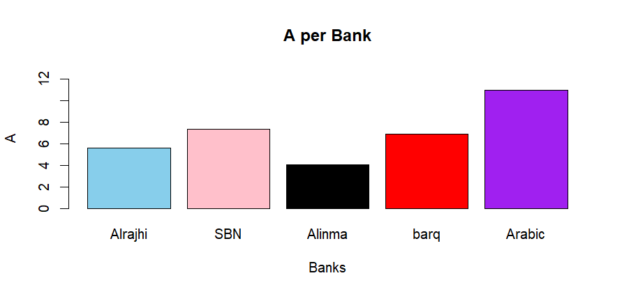
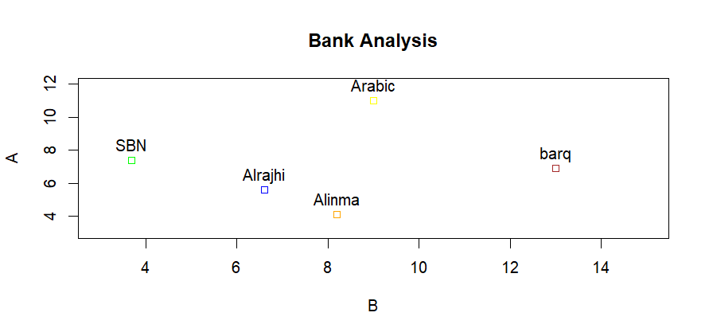

# 📊 Bank Data Analysis using R

## Overview
This project demonstrates descriptive statistical analysis and data visualization using **R** and **R Markdown**.

The analysis includes summary statistics, handling missing values, and creating visualizations to explore banking data.

---

## Tools Used
- R
- RStudio
- R Markdown

---

## Features
- Descriptive Statistics
  - Mean
  - Median
  - Variance
  - Standard Deviation
  - Quantiles
  - Summary Statistics
- Handling Missing Values (NA)
- Bar Chart Visualization
- Scatter Plot Visualization
- HTML Report Generation

---

## Project Output

### Bar Chart
> *(Insert Bar Chart image here)*

### Scatter Plot
> *(Insert Scatter Plot image here)*

---

## Repository Contents

- `Bank_Data_Analysis.Rmd` → Source Code
- `Bank_Data_Analysis.html` → HTML Report
- `README.md` → Project Documentation

---

## Author

**Ahmed Fahd Al-Subaihi**

Bachelor of Statistics  
Qassim University
